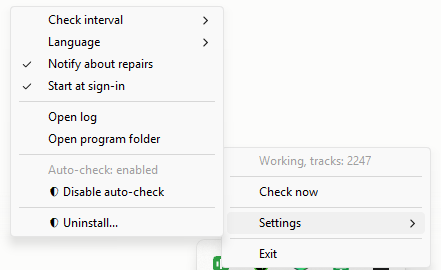
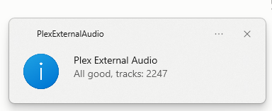
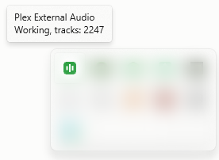

<p align="center">
  
</p>

<h1 align="center">Plex External Audio</h1>

<p align="center">
  Plays audio tracks that sit <b>next to</b> the video instead of inside it.
</p>

Drop a `.mka`, `.ac3` or `.flac` beside your video and Plex lists it among the audio tracks as if it had always been there.
Anime releases with alternative dubs are distributed this way constantly, and Plex cannot handle it: there is no native support for external audio, and no plugin system since 2018.

Tested on Plex 1.43.3, Windows 11: 2247 external tracks across a library of 5212 video files, mapped in twenty seconds.

<p align="center">
  
</p>
<p align="center"><i>Two external dubs, listed by Plex as if they were inside the file.</i></p>

## Install

Run the installer.
One UAC prompt and it is done - it finds Plex, the database and ffprobe by itself, swaps in the transcoder wrapper and puts a tray icon in place.
It needs `ffprobe`, part of ffmpeg, to read your audio files; if your machine has none, the installer downloads one and keeps just that single file.

Uninstalling is the normal Windows way: Apps and features, or Uninstall in the tray menu.
Both restore the original Plex transcoder and offer to clear the tracks out of the database.
Your audio files are never touched.

## Where the audio files can live

Anywhere under the video's own folder, at any depth.
The audio file has to be named after the video; the track title comes from the folder it sits in.

```
Series/
  Episode 01.mkv
  Episode 01.mka                        -> track from the file's own tag
  RUS Sound/[Group A]/Episode 01.mka    -> track "Group A"
  RUS Sound/[Group B]/Episode 01.mka    -> track "Group B"
```

A title inside the file wins; failing that the `VIDEO.language.Title.ext` scheme is used, and failing that the folder name.
The language is a three-letter code in the filename, or a tag inside the file.

## How it works

The mapper writes rows into Plex's `media_streams` table with `index >= 1000` and `url = file://...`.
Plex takes them for tracks inside the file and duly asks the transcoder for stream 1001.
The wrapper intercepts that, looks the real path up in the database, appends a second `-i` and repoints `-map` / `-filter_complex` at it.
The audio is not re-encoded; Plex handles video by its usual rules.

Two things break this, both silently: a Plex update replaces the transcoder, and a library re-analysis wipes the added rows.
A guard runs on a schedule and repairs both.

A re-analysis takes something else with it.
Plex remembers the audio track you picked as a reference to a `media_streams.id`, and once the row it points at is gone that reference dangles - after which Plex marks no track as selected at all, and its web player dies the moment the audio menu is opened.
So every pass also clears references that lead nowhere.

## The tray icon

<p align="center">
  
</p>

The colour is the state - green means the wrapper is in place, orange means it is not.

**Check** does everything in one press: verifies the wrapper, reinstalls it if a Plex update overwrote it, and tops the database back up if rows went missing.

<p align="center">
  
</p>

**Exit** stops the background work too, not just the icon.
It cannot unregister the scheduled task without a UAC prompt every time you quit, so it leaves a marker the guard checks on startup.
Starting the program clears it.
Exit does not put the original transcoder back - that needs administrator rights and would break playback of the tracks already mapped.
Uninstalling does that.

The interface follows your Windows display language, and can be set by hand in the menu.
12 languages: English, Russian, Ukrainian, German, French, Spanish, Italian, Polish, Brazilian Portuguese, Turkish, Japanese, Simplified Chinese.
Adding one means dropping a single JSON file into `cmd/tray/locales/`.

## Checking on it

Hovering the icon is usually enough:

<p align="center">
  
</p>

For the full picture, including whether the scheduled tasks are alive:

```powershell
& "C:\Program Files\Plex External Audio\Plex External Audio Guard.exe" -status
```

Everything it prints is read from the live system, not from saved state.
The same report goes to `C:\ProgramData\Plex External Audio\status.txt`, and the guard keeps a rotating log beside it.

## Building

Go only, no C compiler (`CGO_ENABLED=0`):

```powershell
powershell -NoProfile -ExecutionPolicy Bypass -File setup\build.ps1 -Installer
```

Binaries land in `bin\`, the installer in `installer\Output\`.

The work is split so that a port has a small target: `internal/plex` holds everything that touches the Plex database, `internal/probe` runs ffprobe, `internal/scan` finds the sidecar files, and `cmd/mapper` and `cmd/transcoder` are thin programs on top.
Those five are portable Go.
`cmd/guard` and `cmd/tray` are the Windows-specific half.

**Run `guardtest\run.py` before touching the guard.**
It is allowed to delete files in `Program Files`, and it once deleted the real Plex transcoder: the guard used to identify its own wrapper by a hash from the config, and after a rebuild that hash no longer matched.
Identification is by an embedded marker string now.
The test drives the guard through five scenarios inside a fake Plex directory.

Binaries are deliberately **not** built with `-s -w`.
Stripping saves a third of the size and gets them deleted on sight by antivirus heuristics, because that is how most Go malware ships.

## Platform

**Windows only** for now.
The mapper and the wrapper are portable Go and cross-compile as they are; the guard and the tray icon are not - they speak to the registry, Win32 and the Task Scheduler.

On a Linux or macOS server the tray icon makes little sense anyway, and the guard would be a systemd timer or a launchd job.
The pieces that would need writing are small and well isolated.
**Pull requests for other platforms are very welcome.**

## Known limits

- A player that cannot decode the external track makes Plex transcode it.
- Browsers will not play Hi10P or FLAC at all; that re-encode is not ours.
- Files Plex has not analysed yet are skipped and picked up on the next run.
- The installer is unsigned, so SmartScreen will call it an unknown publisher.

## Policies

Nothing is sent anywhere: no telemetry, no update check, no analytics, no networking code at all.
The details are in [PRIVACY.md](PRIVACY.md).

How releases are built and who may approve one for signing is in [SIGNING.md](SIGNING.md).

## Credit and licence

The approach - mapping external files into `media_streams` and wrapping the transcoder - was first worked out by [Saoneth/plex-custom-audio](https://github.com/Saoneth/plex-custom-audio), which has been unmaintained since 2021.
This is an independent implementation of the same idea, written against a specification of how Plex behaves rather than from that code, and sharing none with it.

MIT licensed, see [LICENSE](LICENSE).
